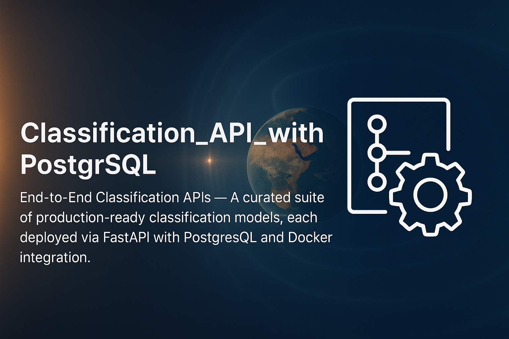

<div align="center">
    
</div>

<div style="font-size:2.5em; font-weight:bold; text-align:center; margin-top:20px;">ML API with PostgreSQL Integration</div>

- Best practices in ML engineering with persistent database storage
- Deploy machine learning models as a FastAPI service, integrated with PostgreSQL, and containerized using Docker for scalability and reproducibility

---

- $\textcolor{#FF4500}{\text{You can easily adapt the repository to work with any dataset of your choice.}}$
- The structure is flexible and can be applied to various machine learning models, including $\textcolor{#1E90FF}{\text{regression, classification, and clustering}}$.

---

***Table of Contents***

<details>
  <summary><a href="#1-about-this-repository"><i><b>1. About this Repository</b></i></a></summary>
  <div>
    &nbsp;&nbsp;&nbsp;&nbsp;&nbsp;&nbsp;&nbsp;&nbsp;&nbsp;&nbsp;<a href="#11-who-is-this-project-for">1.1. Who Is This Project For?</a><br>
    &nbsp;&nbsp;&nbsp;&nbsp;&nbsp;&nbsp;&nbsp;&nbsp;&nbsp;&nbsp;<a href="#12-what-will-you-learn">1.2. What Will You Learn?</a><br>
    &nbsp;&nbsp;&nbsp;&nbsp;&nbsp;&nbsp;&nbsp;&nbsp;&nbsp;&nbsp;<a href="#13-prerequisites">1.3. Prerequisites</a><br>
    &nbsp;&nbsp;&nbsp;&nbsp;&nbsp;&nbsp;&nbsp;&nbsp;&nbsp;&nbsp;<a href="#14-contents-of-this-repository">1.4. Contents of this Repository</a><br>
  </div>
</details>
&nbsp;

<details>
  <summary><a href="#2-project-structure"><i><b>2. Project Structure</b></i></a></summary>
  <div>
    &nbsp;&nbsp;&nbsp;&nbsp;&nbsp;&nbsp;&nbsp;&nbsp;&nbsp;&nbsp;<a href="#21-production-environment-dockerization">2.1. Production Environment (Dockerization)</a><br>
    &nbsp;&nbsp;&nbsp;&nbsp;&nbsp;&nbsp;&nbsp;&nbsp;&nbsp;&nbsp;<a href="#22-machine-learning-components">2.2. Machine Learning Components</a><br>
    &nbsp;&nbsp;&nbsp;&nbsp;&nbsp;&nbsp;&nbsp;&nbsp;&nbsp;&nbsp;<a href="#23-database-integration-components">2.3. Database Integration Components</a><br>
    &nbsp;&nbsp;&nbsp;&nbsp;&nbsp;&nbsp;&nbsp;&nbsp;&nbsp;&nbsp;<a href="#24-testing-components">2.4. Testing Components</a><br>
  </div>
</details>
&nbsp;

<div>
  &nbsp;&nbsp;&nbsp;&nbsp;<a href="#3-project-files-and-folders-overview"><i><b>3. Project Files and Folders Overview</b></i></a>
</div>
&nbsp;

<details>
  <summary><a href="#4-how-to-use-and-test-the-project"><i><b>4. How to Use and Test the Project</i></b></a></summary>
  <div>
    &nbsp;&nbsp;&nbsp;&nbsp;&nbsp;&nbsp;&nbsp;&nbsp;&nbsp;&nbsp;<a href="#41-build-and-start-the-containers">4.1. Build and Start the Containers</a><br>
    &nbsp;&nbsp;&nbsp;&nbsp;&nbsp;&nbsp;&nbsp;&nbsp;&nbsp;&nbsp;<a href="#42-test-the-api-endpoints">4.2. Test the API Endpoints</a><br>
    &nbsp;&nbsp;&nbsp;&nbsp;&nbsp;&nbsp;&nbsp;&nbsp;&nbsp;&nbsp;<a href="#43-run-the-tests">4.3. Run the Tests</a><br>
    &nbsp;&nbsp;&nbsp;&nbsp;&nbsp;&nbsp;&nbsp;&nbsp;&nbsp;&nbsp;<a href="#44-use-jupyter-for-development">4.4. Use Jupyter for Development</a><br>
  </div>
</details>
&nbsp;

<div>
  &nbsp;&nbsp;&nbsp;&nbsp;<a href="#5-database-setup"><i><b>5. Database Setup</b></i></a>
</div>
&nbsp;

<details>
  <summary><a href="#6-database-development-best-practices"><i><b>6. Database Development Best Practices</b></i></a></summary>
  <div>
    &nbsp;&nbsp;&nbsp;&nbsp;&nbsp;&nbsp;&nbsp;&nbsp;&nbsp;&nbsp;<a href="#61-database-interaction-approaches">6.1. Database Interaction Approaches</a><br>
    &nbsp;&nbsp;&nbsp;&nbsp;&nbsp;&nbsp;&nbsp;&nbsp;&nbsp;&nbsp;<a href="#62-recommended-hybrid-approach">6.2. Recommended Hybrid Approach</a><br>
    &nbsp;&nbsp;&nbsp;&nbsp;&nbsp;&nbsp;&nbsp;&nbsp;&nbsp;&nbsp;<a href="#63-setting-up-database-tools">6.3. Setting Up Database Tools</a><br>
  </div>
</details>
&nbsp;

<div>
  &nbsp;&nbsp;&nbsp;&nbsp;<a href="#7-working-with-postgresql-database"><i><b>7. Working with PostgreSQL Database</b></i></a>
</div>
&nbsp;

<div>
  &nbsp;&nbsp;&nbsp;&nbsp;<a href="#8-summary"><i><b>8. Summary</b></i></a>
</div>
&nbsp;

<div>
  &nbsp;&nbsp;&nbsp;&nbsp;<a href="#9-for-additional-questions"><i><b>9. For Additional Questions</b></i></a>
</div>
&nbsp;

# 1. About this Repository

This repository showcases a complete ML engineering pipeline with integrated database support. It enables you to train a machine learning model, deploy it via a FastAPI service, persist predictions in a PostgreSQL database, and experiment interactively using Jupyter Notebook—all within Docker containers. The setup is designed for reproducibility and maintainability.

Key features include:

- **Core Application Elements**:
  - A modular FastAPI application with organized routing and middleware
  - Full PostgreSQL support through SQLAlchemy ORM
  - A dedicated database package containing models, schemas, and CRUD logic
  - Dependency injection for maintainable and testable code

- **Dockerized Infrastructure**:
  - Containers for the API, database, and Jupyter notebook
  - Volume mounts for persistent data and accessible code
  - Environment variable management for flexible deployment
  - Health checks and orchestration for container management

- **Development Tools**:
  - Jupyter notebooks for data analysis and model development
  - Scripts for database initialization and model training
  - A comprehensive test suite for API and database validation

- **Documentation**:
  - Detailed README files in every directory
  - Explanations of architectural choices
  - Complete setup and usage guides
  - Best practices for integrating databases

The project is structured according to clean architecture principles, ensuring clear separation of concerns. It serves as a practical reference for building production-ready ML APIs with database integration.

## 1.1. Who Is This Project For?

This resource is intended for anyone interested in machine learning, API development, database integration, or Docker-based containerization. Whether you are a student, developer, or data scientist, this project will walk you through building and deploying an ML API with persistent storage using FastAPI, PostgreSQL, and Docker.

## 1.2. What Will You Learn?

By completing this project, you will:
- Gain foundational knowledge of FastAPI and its configuration
- Learn how to connect PostgreSQL to a FastAPI app
- Understand how to containerize applications with Docker
- Explore the process of training and deploying ML models
- Work through practical examples to build scalable APIs with persistent data
- Discover how to store and retrieve ML predictions from a database

## 1.3. Prerequisites

This project is suitable for three types of learners:

1. **If you already know Docker, FastAPI, and databases**: Jump straight into deployment. The provided examples and configurations will help you deepen your skills and explore best practices for API/database integration.

2. **If you know Docker and FastAPI but are new to databases**: This project introduces PostgreSQL integration with FastAPI, guiding you through building and deploying an API with persistent storage.

3. **If you are a beginner**: The project is beginner-friendly. You'll start with the basics—setting up Docker, FastAPI, and PostgreSQL—then progress to building and deploying an ML model with database support.

## 1.4. Contents of this Repository

```
Folder PATH listing
.
+---app                           <-- Main application code
|   |   config.py                 <-- App configuration
|   |   database.py               <-- Database connection settings
|   |   main.py                   <-- FastAPI application entry point
|   |   README.md                 <-- API documentation
|   |
|   \---database                  <-- Database components
|       |   crud.py               <-- CRUD operations
|       |   deps.py               <-- Dependency injection
|       |   models.py             <-- SQLAlchemy models
|       |   README.md             <-- Database module docs
|       |   schema.py             <-- Pydantic schemas
|       |   session.py            <-- Session management
|       |   __init__.py           <-- Package initialization
|       |
|       \---migrations            <-- Alembic migrations
|           |   env.py            <-- Alembic environment config
|           |   README.md         <-- Migrations documentation
|           |   script.py.mako    <-- Migration script template
|           |
|           \---versions          <-- Migration scripts
|                   README.md     <-- Versions directory docs
|
+---assets                        <-- Static assets (images, styles, etc.)
|       logo.png                  <-- Project logo
|       README.md                 <-- Assets documentation
|
+---data                          <-- Datasets
|       original_dataset.csv      <-- Example dataset
|       README.md                 <-- Data documentation
|
+---docker                        <-- Docker configuration
|       Dockerfile                <-- API Dockerfile
|       Dockerfile.jupyter        <-- Jupyter Dockerfile
|       entrypoint.sh             <-- Startup script
|       README.md                 <-- Docker documentation
|
+---models                        <-- Trained ML models
|       ml_model.pkl              <-- Serialized model
|       README.md                 <-- Models documentation
|
+---notebooks                     <-- Jupyter notebooks
|       data_exploration.ipynb    <-- Data exploration
|       train_dev.ipynb           <-- Model training
|       README.md                 <-- Notebooks documentation
|
+---scripts                       <-- Utility scripts
|       db_setup.py               <-- Database setup
|       train.py                  <-- Model training
|       README.md                 <-- Scripts documentation
|
+---tests                         <-- Automated tests
|       __init__.py               <-- Test package init
|       test_api.py               <-- API tests
|       README.md                 <-- Tests documentation
|
|   .dockerignore                 <-- Docker ignore rules
|   .gitignore                    <-- Git ignore rules
|   alembic.ini                   <-- Alembic config
|   docker-compose.yml            <-- Docker Compose config
|   LICENSE                       <-- Project license
|   README.md                     <-- Project overview
|   requirements.txt              <-- Python dependencies
```

# 2. Project Structure

## 2.1. Production Environment (Dockerization)

- **docker/Dockerfile**  
  Dockerfile for building the FastAPI app container. Installs all dependencies for serving the model and connecting to PostgreSQL in production.

- **docker/Dockerfile.jupyter**  
  Dockerfile for the Jupyter Notebook container. Installs extra dependencies for interactive development, including PostgreSQL client libraries.

- **docker-compose.yml**  
  Defines three services:
  - `web`: Runs the FastAPI app on port 8000.
  - `jupyter`: Runs a Jupyter Notebook server on port 8888.
  - `db`: Runs the PostgreSQL database for storing predictions.
  
  Volume mounts are used to persist data and make code accessible across containers.

## 2.2. Machine Learning Components

- **models/ml_model.pkl**  
  Pre-trained ML model for Iris classification.

- **scripts/train.py**  
  Script that loads the Iris dataset, trains a logistic regression model, evaluates it, and saves the trained model.
  
- **app/main.py**  
  FastAPI app that loads the model and provides endpoints for predictions and database access.

## 2.3. Database Integration Components

- **app/database/**  
  All database-related code:
  - **models.py**: SQLAlchemy ORM model for predictions.
  - **schema.py**: Pydantic models for request/response validation.
  - **crud.py**: Database operations for creating and retrieving predictions.
  - **session.py**: Manages database sessions.
  - **deps.py**: Dependency injection for FastAPI.

- **scripts/db_setup.py**  
  Script for initializing the PostgreSQL database and creating tables.

## 2.4. Testing Components

- **tests/**  
  Automated tests for API and database:
  - Health check and root endpoint tests
  - Prediction and database storage tests
  - Retrieval of predictions
  - Error handling tests

# 3. Project Files and Folders Overview

- **app/**  
  Main application code:
  - **main.py:** FastAPI app with endpoints and model loading.
  - **config.py:** App configuration using Pydantic.
  - **database.py:** Database connection settings.
  - **database/:** PostgreSQL integration components.

- **assets/**  
  Static assets such as images and styles, including the logo.

- **data/**  
  Datasets used in the project, including the Iris dataset.

- **docker/**  
  Docker configuration files:
  - **Dockerfile:** Builds the API container.
  - **Dockerfile.jupyter:** Builds the Jupyter container.

- **models/**  
  Trained ML models, specifically the Iris classifier.

- **notebooks/**  
  Jupyter notebooks for experiments and analysis:
  - **data_exploration.ipynb:** Iris dataset exploration.
  - **train_dev.ipynb:** Model training and development.

- **scripts/**  
  Utility scripts:
  - **train.py:** ML model training.
  - **db_setup.py:** PostgreSQL setup.

- **tests/**  
  Automated tests for the application.

# 4. How to Use and Test the Project

## 4.1. Build and Start the Containers

1. Clone the repository:
   ```bash
   git clone <repository-url>
   cd ML_API_with_PostgreSQL_Integration
   ```

2. Build and start the containers:
   ```bash
   docker-compose up --build
   ```

This will launch three containers:
- FastAPI app: http://localhost:8000
- PostgreSQL database: localhost:5432
- Jupyter Notebook: http://localhost:8888

## 4.2. Test the API Endpoints

Once running, you can test the endpoints:

1. Swagger UI documentation:
   ```
   http://localhost:8000/docs
   ```

2. Make a prediction with curl:
   ```bash
   curl -X 'POST' \
     'http://localhost:8000/predict' \
     -H 'Content-Type: application/json' \
     -d '{
       "sepal_length": 5.1,
       "sepal_width": 3.5,
       "petal_length": 1.4,
       "petal_width": 0.2
     }'
   ```

3. Retrieve all predictions:
```bash
   curl -X 'GET' 'http://localhost:8000/predictions'
```

## 4.3. Run the Tests

To execute the automated tests:

```bash
docker-compose exec web pytest tests/
```

## 4.4. Use Jupyter for Development

Jupyter Notebook offers an interactive environment for model development, data exploration, and experimentation. You have two main ways to use the notebooks:

### 4.4.1. Access Options

1. **Through IDE (Recommended)**:
   
      ○ For VS Code:
      
         a. Press `Ctrl+Shift+P` (Windows/Linux) or `Cmd+Shift+P` (Mac)
         b. Select "Dev Containers: Attach to Running Container..."
         c. Choose the container named `ml_api_with_postgresql_integration-jupyter-1`
         d. When prompted, open `/app`
         e. Work with notebooks in VS Code with all dependencies available
      
      ○ For Cursor:
      
         a. Click the Remote Explorer icon (or `Ctrl+Shift+P` and search for "Attach to Running Container")
         b. Select `ml_api_with_postgresql_integration-jupyter-1`
         c. Open `/app` when prompted
         d. Work with notebooks in Cursor with all dependencies available

2. **Through Web Browser**:
   
   ○ Go to http://localhost:8888
   ○ All dependencies are pre-installed
   ○ Changes are saved to your local files via Docker volumes

### 4.4.2. Selecting the Correct Kernel

When opening a notebook, ensure you select the right kernel:

1. For a new notebook, click "Select Kernel" in the top right
2. Choose "Python 3.10.16 (/usr/local/bin/python)"
3. This kernel includes all dependencies in the container

### 4.4.3. Verifying the Container Environment

To confirm you're inside the container, run this in a notebook cell:

```python
# Check Python version
!python --version

# View environment variables
import os
print(os.environ)

# Check OS
!cat /etc/os-release
```

You should see:
- Python 3.10.x
- Container-specific environment variables (including DATABASE_URL with 'db' hostname)
- Debian Linux as the OS

### 4.4.4. Working with Notebooks

Provided notebooks:

* `notebooks/data_exploration.ipynb`: Explore the Iris dataset with visualizations and stats
* `notebooks/train_dev.ipynb`: Develop and train the model, experiment with hyperparameters

### 4.4.5. Accessing the Database from Notebooks

To connect to PostgreSQL from your notebook:

```python
from sqlalchemy import create_engine
import os

db_url = os.environ.get("DATABASE_URL")
engine = create_engine(db_url)

# Example query
import pandas as pd
df = pd.read_sql("SELECT * FROM predictions", engine)
df.head()
```

### 4.4.6. Troubleshooting

1. **Kernel not starting**: 
   - Check if the container is running: `docker ps`
   - View logs: `docker logs ml_api_with_postgresql_integration-jupyter-1`

2. **Missing dependencies**:
   - All dependencies are installed from requirements.txt. To add more:
     ```python
     !pip install package_name
     ```

3. **Database connection issues**:
   - Ensure the PostgreSQL container is running
   - Check the DATABASE_URL environment variable: `os.environ.get("DATABASE_URL")`

Note: When using the IDE, you are working inside the container with all dependencies installed. This ensures consistency between development and production.

# 5. Database Setup

This project uses PostgreSQL to store prediction data. There are two ways to manage the database schema:

## 5.1. Direct Table Creation

By default, tables are created directly for simplicity:

1. Tables are auto-created at app startup using SQLAlchemy's `Base.metadata.create_all()` in `app/main.py`.
2. The custom setup script `scripts/db_setup.py` runs during container startup to ensure tables exist.

This approach is simple and works well in containerized environments where databases may be recreated.

## 5.2. Using Migrations

Although Alembic is set up for migrations, migration scripts are not used by default. To use migrations:

1. Update SQLAlchemy models in `app/database/models.py`
2. Generate a migration script:
   ```bash
   alembic revision --autogenerate -m "Description"
   ```
3. Apply the migration:
   ```bash
   alembic upgrade head
   ```

# 6. Database Development Best Practices

When developing with databases in Docker, there are several ways to interact with the database. This section outlines best practices for database development in this environment.

## 6.1. Database Interaction Approaches

### 6.1.1. Using Jupyter Notebooks

**Advantages:**
- **Unified environment**: Code, data visualization, and database access in one place
- **Self-documenting**: Notebooks serve as records of SQL exploration
- **Visualization**: Easily plot query results
- **Reproducibility**: Queries and results are saved together

**Best for:**
- Data exploration
- Building data pipelines
- Prototyping database operations
- Learning and experimentation

### 6.1.2. Using VS Code/Cursor Database Extensions

**Advantages:**
- **Specialized tools**: Features like schema visualization and query optimization
- **SQL-centric interface**: Enhanced syntax highlighting and autocompletion
- **Database admin**: Easier to perform admin tasks
- **Separation of concerns**: Keeps DB work separate from app code

**Best for:**
- Schema design
- Complex query development
- Database administration
- Day-to-day DB operations

## 6.2. Recommended Hybrid Approach

The most effective workflow combines both methods:

1. **Use VS Code/Cursor extensions for:**
   - Initial setup and schema management
   - Complex SQL queries
   - Production migrations
   - Admin tasks

2. **Use Jupyter Notebooks for:**
   - Data exploration
   - Combining SQL with data processing
   - Documenting workflows
   - Visualizing results
   - Prototyping ML pipeline DB interactions

## 6.3. Setting Up Database Tools

### 6.3.1. VS Code/Cursor Database Extension Setup

1. Install `Database Client` or `SQLTools` + `SQLTools PostgreSQL/Cockroach Driver` in VS Code/Cursor
  - `Database Client`: by cweijan
  - `SQLTools`: by Matheus Teixeira
  - `SQLTools PostgreSQL/Cockroach Driver`: by mtxr

2. Configure a new connection:
   - Host: `localhost`
   - Port: `5432`
   - Username: `user`
   - Password: `password`
   - Database: `ml_api_db`

3. `Database Client` vs. `SQLTools` + `SQLTools PostgreSQL/Cockroach Driver`
  - `Database Client`: simple GUI, easy browsing, minimal setup
  - `SQLTools` + driver: powerful code integration, deep customization

  **Option 1: Database Client**
  - All-in-one, built-in PostgreSQL support
  - **Best for:** Visual learners, beginners, ease of use
  - Modern interface, intuitive data exploration
  - Simple setup
  - Interactive data grid view
  
  **Option 2: SQLTools + Driver**
  - Two-part install: core extension plus driver
  - **Best for:** Advanced users needing more features
  - Comprehensive SQL tooling
  - Robust intellisense & linting
  - Highly extensible
  
  Both connect to the project's PostgreSQL DB with the same settings. Choose based on your learning style—visual learners may prefer Database Client, while those who want more customization may prefer SQLTools.

  **Feature Comparison:**

  | Aspect              | SQLTools                                                                                                                                                            | Database Client                                                                                                                                            |
  |-------------------------|------------------------------------------------------------------------------------------------------------------------------------------------------------------------|------------------------------------------------------------------------------------------------------------------------------------------------------------------------------------------------------------|
  | Setup & Configuration | ✅ Large community & docs  <br> ✅ Multiple adapters (MySQL, Postgres, etc.) <br> ❌ More config-heavy (JSON files) <br> ❌ Manual adapter installs needed | ✅ Minimal config required <br> ✅ Quick setup out of the box <br> ❌ Limited advanced settings <br> ❌ Not as flexible with niche databases |
  | UI & Navigation     | ✅ Familiar code-based workflow <br> ✅ Lightweight, integrates well into editor <br> ❌ Less visual exploration <br> ❌ Feels "techy" to newcomers | ✅ GUI-based table browsing & editing <br> ✅ Easy schema view in the sidebar <br> ❌ Can feel heavier/cluttered if you prefer code <br> ❌ Fewer inline code features |
  | Auto-Completion     | ✅ Robust intellisense & linting <br> ✅ Good for large/complex schemas <br> ❌ Requires fine-tuning for some DB engines | ✅ Basic suggestions for major SQL dialects <br> ✅ Enough for quick queries <br> ❌ Not as powerful or customizable as SQLTools <br> ❌ Lacks deeper query analysis |
  | Customization       | ✅ Highly extensible (plugins, adapters) <br> ✅ Fine-grained JSON config <br> ❌ Can be daunting for beginners <br> ❌ Takes time to master | ✅ Straightforward "turnkey" experience <br> ✅ Simple configuration menus <br> ❌ Smaller ecosystem <br> ❌ Fewer ways to adapt to unusual or advanced requirements |
  | Community & Support | ✅ Very large user base, lots of tutorials <br> ✅ Frequent updates & GitHub activity <br> ❌ Some help documents can be spread out <br> ❌ Might lag behind if a DB is extremely new | ✅ Growing but smaller community <br> ✅ Clear official docs <br> ❌ Not as many community-driven resources <br> ❌ Might not have direct support for very new or specialized databases |

**Symbols Used**
- ✅ = Primary strength / core functionality
- ❌ = Limitation / drawback

### 6.3.2. Python Code Pattern for Notebooks

```python
from sqlalchemy import create_engine, text
import pandas as pd
import os

db_url = os.environ.get("DATABASE_URL")
engine = create_engine(db_url)

def run_query(query):
    """Run a SQL query and return results as a DataFrame"""
    with engine.connect() as conn:
        result = conn.execute(text(query))
        return pd.DataFrame(result.fetchall(), columns=result.keys())

# Example usage
df = run_query("SELECT * FROM predictions LIMIT 10")
df.describe()  # Quick statistics
```

This hybrid workflow gives you the benefits of both specialized database tools and seamless integration with your data science workflow in notebooks.

# 7. Working with PostgreSQL Database

Unlike SQLite, which uses a single file, PostgreSQL is a client-server system that manages data internally. This section explains how data is stored and accessed in this project.

## 7.1. Database Storage in PostgreSQL

When you store data using this API:

1. **Data Storage**: PostgreSQL keeps all data in its internal directory, mounted as a Docker volume (`postgres_data:/var/lib/postgresql/data/`).

2. **No Single Database File**: There is no database file in your project directory. PostgreSQL manages its own data files.

3. **Persistence**: The Docker volume ensures data is retained even if containers are stopped or rebuilt.

## 7.2. Accessing PostgreSQL Data

You can access stored data in several ways:

1. **API Endpoints**: Use `/predictions` to retrieve data.

2. **Direct Database Access**: Connect to PostgreSQL with:
   ```
   Host: localhost
   Port: 5432
   Username: user
   Password: password
   Database: ml_api_db
   ```

3. **From Jupyter Notebooks**: Use the SQLAlchemy code pattern in section 6.3.2.

4. **Database GUIs**: Use tools like pgAdmin, DBeaver, or VS Code/Cursor extensions.

## 7.3. Database Inspection Commands

With containers running, inspect the database with:

```bash
# Enter PostgreSQL container shell
docker exec -it ml_api_with_postgresql_integration-db-1 bash

# Connect to PostgreSQL
psql -U user -d ml_api_db

# Useful psql commands:
# \dt - list tables
# \d+ predictions - show table structure
# SELECT * FROM predictions LIMIT 5; - view data
# \q - quit psql
```

## 7.4. Backing Up and Restoring Data

To back up and restore PostgreSQL data:

```bash
# Backup from host
docker exec -t ml_api_with_postgresql_integration-db-1 pg_dump -U user ml_api_db > backup.sql

# Restore from host
cat backup.sql | docker exec -i ml_api_with_postgresql_integration-db-1 psql -U user -d ml_api_db
```

PostgreSQL's client-server design offers advantages like better performance, concurrent access, and robust data management compared to file-based databases.

# 8. Summary

This project demonstrates how to build an ML API with PostgreSQL integration using FastAPI and Docker. It provides a complete framework for:

1. Training and serving ML models
2. Storing predictions in PostgreSQL
3. Retrieving prediction history
4. Running everything in Docker for reproducibility and scalability

The project is designed to be easily adaptable for different ML tasks and datasets, with a strong focus on engineering best practices.

# 9. For Additional Questions

If you have questions or run into issues, here are some resources:

- **GitHub Issues**: Open an issue in the repository
- **Documentation**: See the README files in each directory
- **External Resources**:
  - [FastAPI Documentation](https://fastapi.tiangolo.com/)
  - [SQLAlchemy Documentation](https://docs.sqlalchemy.org/)
  - [PostgreSQL Documentation](https://www.postgresql.org/docs/)
  - [Docker Documentation](https://docs.docker.com/)
- **Contact**: Reach out to the project maintainers
